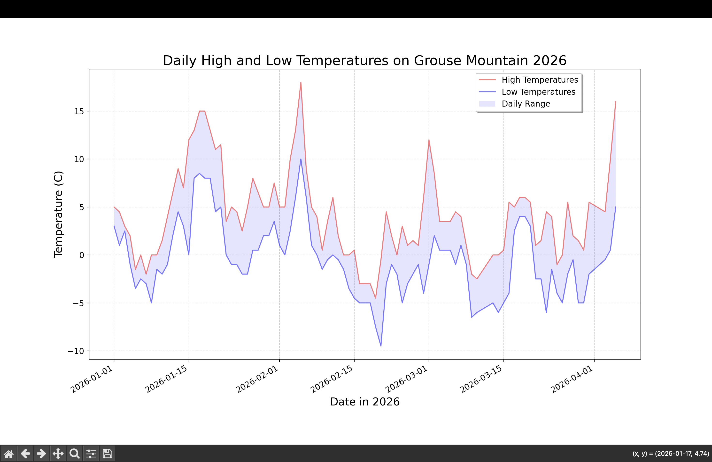

# Grouse Mountain Temperature Analysis 

#Description 
Our project is a visual analysis of the High and Low Temperatures on Grouse Mountain over different timeframes.
Our first graph displays the general trends of temperatures in the year of 2026. Since Grouse Mountain is located in North Vancouver, we thought it would be interesting to learn more about weather changes and patterns in a local area.
Additonally, we created a second graph comparing snowfall over a 50 year period. For this graph, we used data from Whistler as we could not locate enough historical data for Grouse Mountain. The graph looks at snowfall in Whistler at the Whistler Roundhouse in 1973 and compares it with the snowfall there in 2023. 

#Features 
* Shaded Daily-range: Uses 'fill_between' function to shade daily range between highs and lows
* Grid Lines: Makes it easy to identify precise values on graph 
* Legend: Allows user to identify symbols and colours on graph
* Error Handling: Uses 'try-except' functions to detect and ignore incorrect data so that the program doesn't crash

#Built With 
* Matplotlib - Transforms raw data into graphs 
* CSV module - Used to read and extract data from CSV files
* Python 3.x 

*Pre-requisites 
Install Matplotlib
'''bash
pip install matplotlib

#Credits 
https://climate.weather.gc.ca/climate_data/daily_data_e.html?hlyRange=%7C&dlyRange=1960-01-01%7C1961-12-31&mlyRange=1960-01-01%7C1961-12-01&climate_id=1105656&Prov=BC&urlExtension=_e.html&searchType=stnName&optLimit=yearRange&StartYear=1840&EndYear=2026&selRowPerPage=25&Line=1&searchMethod=contains&Month=12&Day=8&txtStationName=north+vancouver&timeframe=2&Year=1961

#Writers 
Lauren Desprez
Kiana Sahota 

