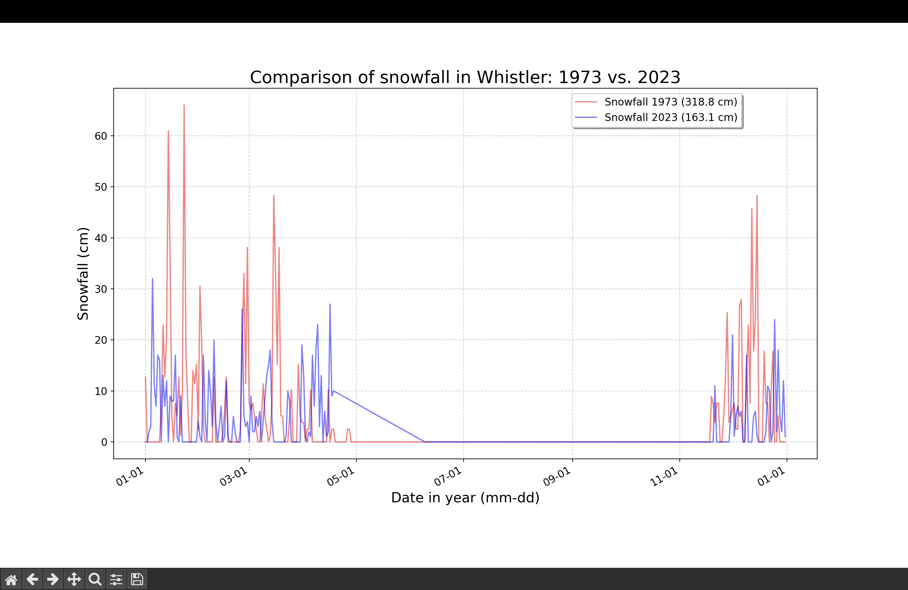

# Grouse Mountain Temperature Analysis 

# Description
This project provides a visual analysis of high and low temperatures on Grouse Mountain and a comparative study of snowfall in Whistler.

Graph 1: Displays the general temperature trends for Grouse Mountain (North Vancouver) in 2026.

Graph 2: Compares snowfall over a 50-year period (1973 vs. 2023) at the Whistler Roundhouse. This comparison uses Whistler data to provide a comprehensive historical perspective that was unavailable for Grouse Mountain.

# Features
Shaded Daily Range: Uses the fill_between function to highlight the variance between highs and lows.

Grid Lines: Makes it easy to identify precise values on graph.

Legend: Allows user to identify symbols and colours on graph.

Error Handling: Uses try-except block to ensure the program ignores missing data points instead of crashing.

Data Iteration: Efficient loops to extract and process dates and temperatures from large datasets.

# Built with
Python 3.x

Matplotlib: For data visualization and graph generation.

CSV Module: For reading and extracting weather data.

Datetime: For managing and formatting date notation (yyyy-mm-dd).

Pathlib: For reliable file path handling.

# Code Overview
Data Extraction with Error Handling

The program iterates through CSV rows and uses a try-except block to manage missing values common in weather datasets.

Python
dates, highs, lows = [], [], []

for row in reader:
    current_date = datetime.strptime(row[4], '%Y-%m-%d')
    try:
        high = float(row[9])
        low = float(row[11])
    except ValueError:
        print(f"Error parsing data at {current_date}")
        continue
    else:
        dates.append(current_date)
        highs.append(high)
        lows.append(low)
Visualizing Temperature Ranges

We use fill_between to create a shaded area that represents the daily temperature spread.

Python
ax.plot(dates, highs, color='red', alpha=0.5, label='High Temperatures')
ax.plot(dates, lows, color='blue', alpha=0.5, label='Low Temperatures')
ax.fill_between(dates, highs, lows, facecolor='blue', alpha=0.1, label='Daily Range')

# Pre Requisites 
You must have Matplotlib installed to run the visualizations:

Bash
pip install matplotlib

# How To Run
Clone or download this repository.

Ensure the required CSV files (e.g., whistler_snow_73.csv, whistler_snow_23.csv) are in the project directory.

Open grouse_mtn_data.py or whistler_snow.py in your IDE.

Execute the program:

Bash
python grouse_mtn_data.py
A window will open displaying the trends. Close the window to end the session.

# Credits
Data Provider: Environment and Climate Change Canada

# Writers
Lauren Desprez & Kiana Sahota

